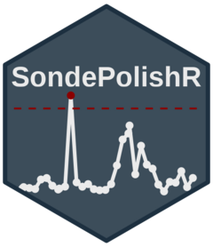
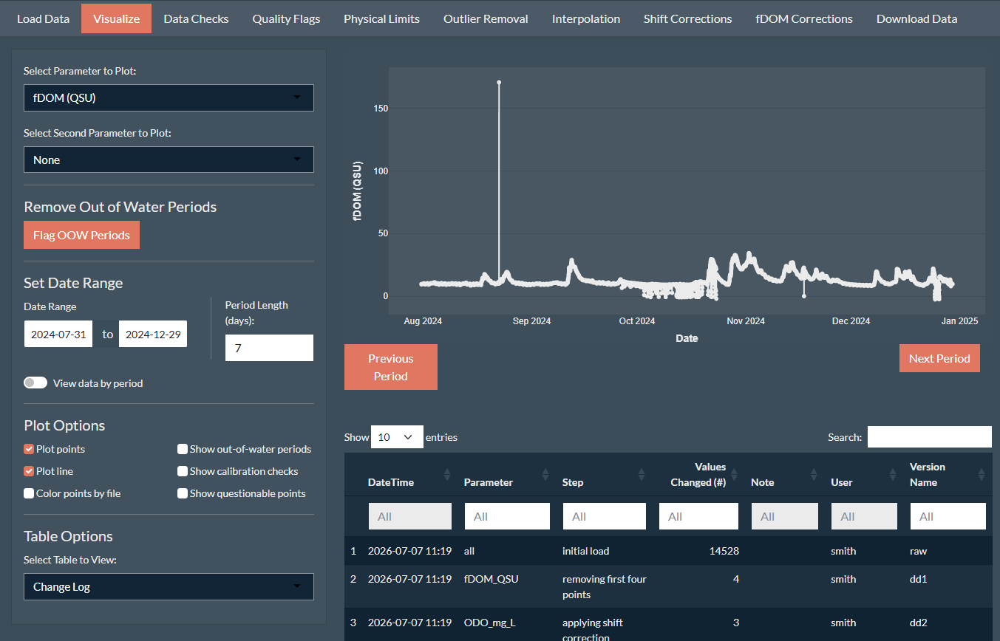
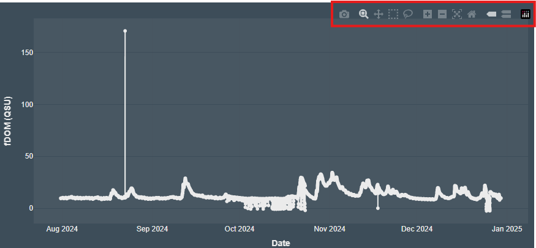
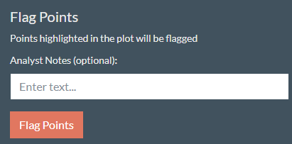
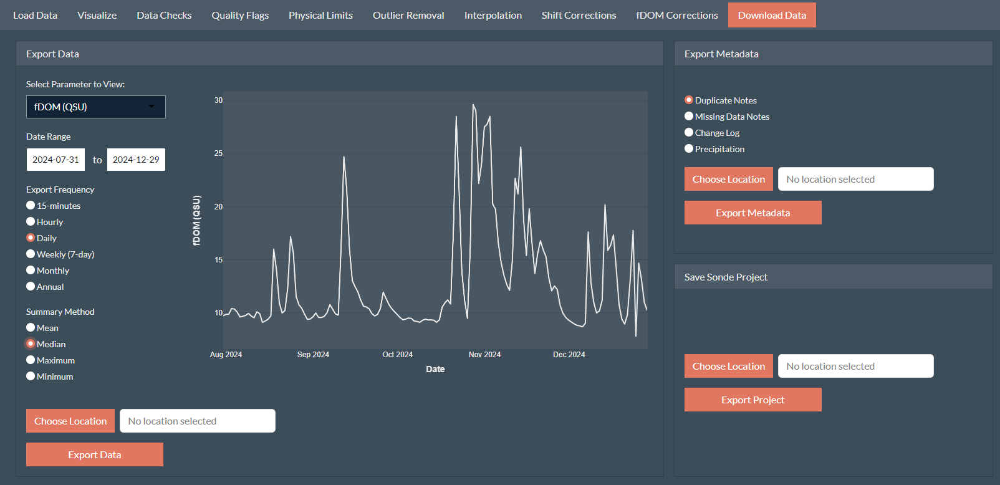

<!-- README.md is generated from README.Rmd. Please edit that file -->

```{r, include = FALSE}
knitr::opts_chunk$set(
  collapse = TRUE,
  comment = "#>",
  fig.path = "man/figures/README-",
  out.width = "100%"
)
```

# SondePolishR 


Provides an interactive workflow for quality assurance and quality control (QA/QC) of water quality sonde data. The package and associated Shiny app enables users to import raw sonde datasets, review and correct observations, apply quality flags, visualize time-series data alongside associated metadata, summarize observations,and export cleaned datasets and metadata while maintaining a reproducible record of all edits.

## The Need

Continuous water quality data is extremely useful due to it's high resolution, however because of its high resolution, performing QA/QC can be extremely challenging due to the number of data points. Additionally, since sondes are typically in streams for long stretches between maintenance visits, the data can be extremely messy. These all make cleaning sonde data extremely time intensive and challenging.

While some tools exist to help clean sonde data they are either expensive (Aquarius); have limited correction capacity ([ContDataQC](https://github.com/USEPA/ContDataQC)); or is no longer maintained ([ODM Tools](https://github.com/ODM2/ODMToolsPython)). Thus there is a need for a free, open-source interactive tool.

This package was developed as part of the [Wildfire and Water Security Project](https://wws.forestry.oregonstate.edu/overview).

## Installation

You can install the development version of SondePolishR from [GitHub](https://github.com/) with:

``` r
# install.packages("pak")
pak::pak("wildfire-water-security/WWS-Node1-SondePolishR-sonde-qaqc")
```

## Using the App

While the package contains a number of functions that are useful for correcting sonde data, the main part of this package is the Shiny app which allows the user to interactively load, view, correct, and export sonde data.

To load the app, simply run:

```{r load app, eval=FALSE, include=TRUE}
library(SondePolishR)
run_app()
```

## App Overview

The app works by creating and modifying a sonde project (`sondeproj`) object which is a list containing sonde data, flags, and metadata. See `help(example_sondeproj)` for more details on project structure.

The app consists of ten modules or pages. *While they are put in an order that represent a typical correction workflow, the steps do not need to be performed in order.*

1.  **Load Data:** Load either an existing sonde project, load raw data and metadata to create a sonde project, or amend an existing sonde project with new data. Can also load or download precipitation data to include with the project.

2.  **Visualize:** Explore the loaded data via an interactive plot, view metadata or data summary statistics. Can also view data versions and remove periods where the sonde was out of the water.

3.  **Data Checks:** View summaries of data gaps and duplicates. Resolve duplicates and add notes about duplicate/missing data.

4.  **Quality Flags:** Flag data points as being questionable. These flags can be visualized in other plots across modules and used to automatically select points in outlier removal.

5.  **Physical Limits:** Removes data points outside a specified range. Limits default to common sensor measurement limits.

6.  **Outlier Removal:** Remove outlier data points. Removal can be done via a combination of automatic outlier detection and manual addition or removal of points.

7.  **Interpolation:** Fill in missing data points using interpolation. User can select between several different interpolation methods and can control how big of a gap is filled via interpolation.

8.  **Shift Corrections:** Perform a shift correction for a selected set of points or apply a linear drift correction to a specific file. Drift corrections are based on calibration checks when provided.

9.  **fDOM Corrections:** Apply temperature and turbidity corrections to fDOM data using one of several methods. Methods default to published coefficient values but can be set to custom values.

10. **Download Data:** Generate and view time summarized data; export data and metadata; and save the sonde project.

## Key App Functionality

### Exploring the Data

Most modules include an interactive plot created via [plotly](https://plotly.com/r/) used to visualize the data and select points. These plots have a number of options that can be used to explore the dataset and make decisions about corrections.



-   **Plotted parameter:** Select the primary data being shown and control which parameter is being corrected.

-   **Secondary parameter:** Select a variable for a secondary y-axis. Option include other variables within the dataset, the raw uncorrected data, or precipitation data if loaded.

-   **Date Ranges:** View only data within the specified date range.

-   **Period View:** As an alternative to specifying date ranges, used to view data for a specified period length (e.g., weekly) and move between periods.

-   **Plotting Options:**

    -   **Plot points:** Displays data points.

    -   **Plot lines:** Displays data as a line.

    -   **Color points by file:** Color the data points by their file name.

    -   **Show out-of-water periods:** Displays the out-out-water periods as shaded rectangles if metadata is provided.

    -   **Show calibration checks:** Displays calibration check measurements if metadata is provided.

    -   **Show questionable points:** Colors points marked as questionable in orange.

In addition to the options provided by `SondePolishR`, `plotly` plots also natively have some built in tools like plot export and drag to zoom features located in the top right corner of the plot.



### Correcting and Flagging Data



One of the other main workflows included throughout the app is modifying and flagging data.

Each module or tab uses it's own methods to select points. Some select points via numeric inputs in the sidebar (physical limits), others use points selected in the plot by the user (i.e., outlier removal). Once the user is satisfied with the points selected, the data can be flagged.

**When data is flagged:**

-   The selected points are modified, added, or removed within the dataset (unless the step is marking points as questionable which doesn't alter the data).

-   A flag is added to any modified points to explain what change was made to the data (or mark the data as questionable).

-   Data changes are captured in a `diff` which is used to track the changes made to the data and move between data versions.

-   A log is added to the change log (viewable in the Visualize tab) showing the parameter, the number of points changed, the step, the user, notes about the change (e.g., the limits used for removal), and any user added notes.

### Version Control

A key principle of data management is reproducibility: being able to reproduce the steps to get from the raw dataset to the clean dataset. To do this for sonde data corrections is a laborious process requiring detailed notes for each change.

The SondePolishR app automates this process. It keeps a descriptive record of changes made in addition to creating a `diff` file which tracks the specific changes made. The `diff` files are stored in a list within the project.

Within the app you can view how the data looks in different versions in the Visualize tab by selecting rows in the change log table. This uses the `apply_diff()` function which can be used outside the app to move from the raw data set to the cleaned dataset or can be used to "undo" changes and go from the cleaned data to the raw data.

### Data Export



The sonde project itself is stored as an `.RDS` object which is easily useable by R. However it is not the most user friendly.

The **Download Data** tab offers a number of options to generate clean, immediately usable data exports.

-   **Data frequency:** Summarizes the data to commonly used intervals (e.g., hourly, weekly, annual).

-   **Summary method:** Used to determine the summary method to use (e.g., mean, median, minimum, max).

In addition to the data, the user can also export metadata contained within the project including:

-   Duplicate and gap tables with added user notes

-   Hourly precipitation data (download from [NASA power](https://power.larc.nasa.gov/) via the `nasapower` package)

-   Change log
