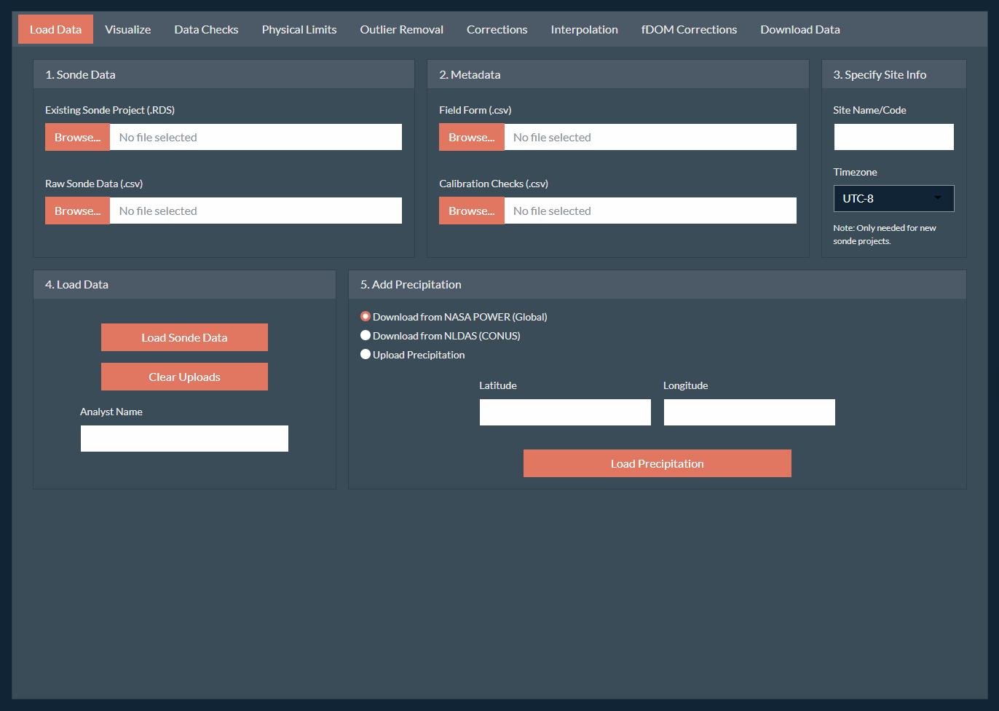
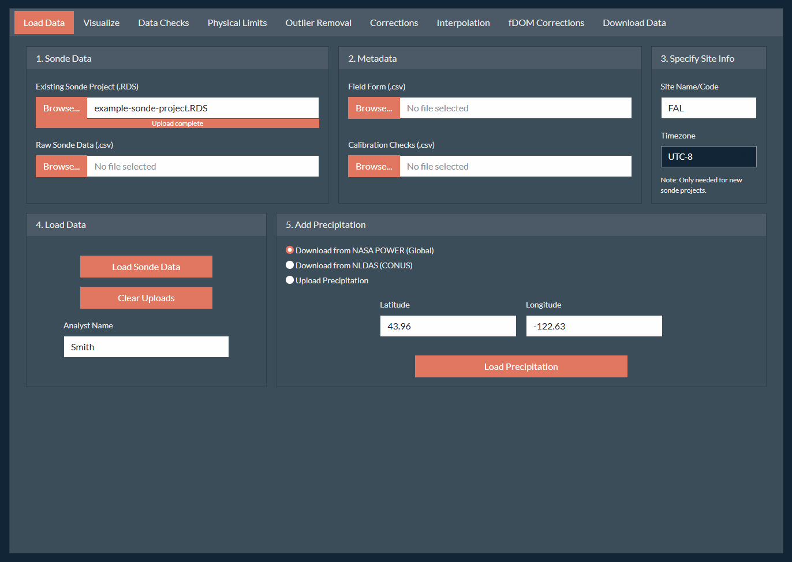

```{css style settings, echo = FALSE}
blockquote {
    padding: 10px 20px;
    margin: 0 0 20px;
    font-size: 14px;
    border-left: 5px solid;
}
```

# Overview

Correction of continuous water quality records can be a complicated task as the data can span a large period and can include several parameters which may require different types of corrections and checks. Additionally, some corrections (i.e., turbidity) may effect other parameters (i.e., fDOM).

We suggest using the following workflow as the default process for correcting a complete water quality record of stream water quality using the `SondePolishR` app. You may wish to modify for your own specific workflows and needs.

***TODO: include a workflow diagram here.***

Throughout this tutorial we will refer to **tabs** and **panels**.

-   **Tabs** are the different pages within the app that can be accessed using the names on the top of the app (i.e., Load Data, Visualize, Data Checks)
-   **Panels** are the hideable sections with the sidebar on the left (i.e., Select Parameters, Save Edits, Date Ranges, Plotting Options).

# Step 1: Open the App

1.  Install the `SondePolishR` package.

    ```{r eval=FALSE, include=TRUE}
    pak::pak("wildfire-water-security/WWS-Node1-SondePolishR-sonde-qaqc")
    ```

2.  Run the follow code to open the app:

    ```{r eval=FALSE, include=TRUE}
    library(SondePolishR)
    run_app()
    ```

# Step 2: Load Data

1.  **Specify data file locations.** Upon loading the app, you should be on the **Load Data** tab. On the first card (1. Sonde Data), use the **Browse** button to navigate to the data file(s) you want to load. *This step does not load the data.* It simply tells the app were the data you want to load is located.

    > Specifically, this step will copy your selected files to temporary folder which is where the app loads the files from, so no changes will be made to your original data files.

    -   If you have an existing project saved from previously using the app you can load this using the **Existing Sonde Project** option.

    -   Otherwise, load one or more `.csv` files using the **Raw Sonde Data** option.

    -   If you would like to add new raw files to an existing project, you may select both a project and a raw file. They will be merged together upon load.

2.  **Specify metadata file locations.** Similar to locating your data files, you can select metadata files to add to your project. These include:

    -   A **field form** (`help(example_fieldform)`) which describes information from field visits and is used to calculate out of water periods.

    -   A **calibration check file** (`help(example_calcheck)`) which contains data from field calibration checks used to make drift corrections.

    > Both files are optional but some app options will not work without them (e.g., viewing or removing out of water periods, better automated guesses for drift corrections).

3.  **Specify site code and site timezone.**

    -   Specify a site code or name which will be used for default file names and included in any data exports.

    -   Select the appropriate timezone for your dataset. It is assumed that all files (raw data and metadata) use this same timezone.

    > If you're loading a project and have previously specified this info you do not need to re-add it, this info gets saved within the sonde project and will be loaded with the rest of the data.

4.  **Load the data.** Use the **Load Data** section to load your selected data by clicking the **Load Sonde Data** button.

    -   The loaded files will remain unless a new file is uploaded. If you're switching to a new site or data project, it's recommended to clear your file uploads first using the **Clear Uploads** button which will clear all the file locations.

5.  **Load Precipitation Data.** Precipitation data can be extremely helpful in making decisions about data corrections as it can help determine if observed spikes could have been caused by increased flows. There are currently three options for adding precipitation data to the project:

    -   **NASA Merra-2 (POWER):** This dataset is available across a global scale at a resolution of 0.5 x 0.625 degrees available from 1981 to near real time at an hourly scale. Due to it's global coverage, it may not capture small or localized events as well.

    -   **NASA NLDAS:** This dataset is available across CONUS at a resolution of 0.125 × 0.125 degrees available from 1981 to near real time at an hourly scale. This data requires a token to access the data. See [NASA Earthdata](https://urs.earthdata.nasa.gov/documentation/for_users/user_token) for directions on creating a token. *Note that this token should be kept secret.*

        > The API for this product can be unreliable, it make take a bit to load and you may need to try more than once.

    -   **User uploaded precipitation:** You can also upload a custom precipitation file. See `help(example_precip)` for details on the structure of this file.

    If you choose to download precipitation data, input your site latitude and longitude, enter your earth data token (if applicable) and click **Load Precipitation**. This will download hourly precipitation data at the specified point over the date range of your data.

```{r, echo=FALSE, out.width="100%"}

```

# Step 3: Save Initial Project

While every effort has been made to prevent the app from crashing. It's a new app, still under development and bugs can occur. **It's recommend to save your project frequently** to prevent loss of work. To save your project:

1.  Navigate to the **Download Data** tab on the far right.

2.  Locate the **Save Sonde Project** section in the bottom right. Similar to uploading your data, use the **Choose Location** button to select where you want to save your project to and what name to use for your project. You can use the selector in the top to change your root directory. Click **Save** to confirm the save location.

    > **Important:** Your project is not saved at this point! You must also click the **Export Project** button to save the project to your specified file.

3.  Click **Export Project** to save your project to the specified file.

```{r, echo=FALSE, out.width="100%"}

```

# Step 4: Initial Data Checks

After creating your project (or adding data to an existing project), it's helpful to get a sense of what the data looks like before performing corrections.

1.  Navigate to the **Visualize** tab. This tab used to provide summary data, access to metadata tables, undo edits, and visualize the data.

2.  **Remove known out of water periods.** Out of water periods are times the sonde has been removed from the stream to download data or perform maintenance. We want to remove the regions as we know that those measurements will not be representative of the stream conditions.

    -   If you have included field form metadata, you can visualize periods when the sonde was out of the water by going to **Plotting Options** and **Show out-of-water periods**. This will display the periods as red boxes on the plot.

    -   To remove data from the highlighted periods, click the **Flag OOW Periods** button. This will remove measurements across all parameters during those periods.

        > **Note:** The measurement taken right before and after the sonde was removed from the water is also removed to prevent issues with time difference between the recorded time and the sonde time and short equilibrium periods. *If no times are specified in the field form, the OOW period will default to the entire day of the field visit.*

3.  **Check for data duplicates.** While not the most common, duplicates in the data record can occur. This is typically due to:

    -   Sonde replacement when the deployment isn't immediately stopped on the old sonde.

    -   Instrument malfunction.

    You can identify duplicate records using the **Data Checks** tab. Any identified duplicates will be show as a table which describes the type of duplicate and the length. To address a duplicate click on a row of the table.

    -   A plot showing the duplicated region will be displayed. You can choose to keep a specific set, average the duplicated region, or remove both sets. Add an optional note about why you chose the method you did, and click **Resolve Duplicate**.

    -   Repeat these steps to resolve all duplicated regions of the data.

4.  **Document data gaps.** Gaps in the data record are much more common and may be due to instrument maintenance, dead batteries, or instrument malfunction. Visualize any data gaps by selecting the **Gaps** table under **Table Options.**

    -   You can add a user note describing the reason for the data gap (if known), by double clicking the appropriate row under **User Notes**. This note will be saved in the metadata of the project and can be exported.

    > It may be helpful to examine the field notes while documenting data gaps. To view the field notes, go to the **Visualize** tab, and select **Field Form** under **Table Options**.

5.  **Briefly view all parameters.** Before starting to correct data, it is often useful to briefly examine the data records to get a feel for your data. You can do this from the **Visualize** tab using the **Select Parameters** section to view each parameter.

6.  **Save the project.** Navigate back to the **Download Data** tab and click the **Export Project** button to save a new copy of your project. When prompted if you want to overwrite your project you can safely overwrite it unless you want to keep a unedited copy of your project.

# Step 5: Turbidity

Turbidity is often one of the most challenging records to correct. Turbidity signals can reach very high peaks in a short time period. However, since it's an optical sensor, peaks can also be due to optical interference (e.g., a leaf near the sensor). A critical part of the cleaning process for turbidity is to remove these "bad" spikes caused by interference while not removing real spikes in turbidity.

## Step 5.1 Remove any data outside of the sensor's physical limits.

Navigate to the **Physical Limits** tab and select turbidity under **Select Parameters**. This will display the data with the default range of the sensor (uses YSI EXO probe limits), with any data outside this range shown in red.

> **Note:** Particularly in very clean streams, turbidity may dip below 0 FNU, meaning the stream water is cleaner than the water used to calibrate the sonde. In these cases, you likely want to set the minimum limit to slightly below 0 to avoid removing this data.

If there are any points outside of the physical limits you wish to remove, use the **Save Edits** panel to edit the data. A default note will indicate the limits used to remove data, but you may also add additional information. Click **Remove Points** to save the change.

## Step 5.2 Remove Outlier Points.

Next we will review the record and remove points that are clearly bad, or mark points as questionable. The bad points will be flagged and removed from the dataset. The questionable points will be flagged in the final dataset.

1.  **Use a filter to auto-select likely bad points.** Under **select starting method** choose the "Hampel Filter" option. See `identify_outliers()` for more details about selection methods.

    -   You may need to adjust the **window size** (i.e., determines how many nearby points it looks at) or **threshold** (i.e., how "bad" a point has to be to be flagged) for your data. It will likely not be perfect, the next step is to manually review all these selections.

2.  **Adjust the plot to better visualize turbidity data.**

    -   Use the **Date Ranges** panel to set a period length of **15** days and use the slider to **view data by period**.

    -   Adjust the **max y-value** to the left of the plot to the range of your data. It defaults to the maximum value across the entire dataset, which is likely to be high due to turbidity peaks.

        > **Note:** Do not set the max y-value to lower than around 5-10 FNU to avoid zooming in too much on very small shifts in turbidity.

    -   If you loaded precipitation data or have depth data. Add that to the plot as a second y-axis using the **Select Parameters** panel. This information is extremely helpful when trying to determine real peaks from spurious ones.

3.  **Review the selections.** Review the entire record, one period at at time to check the points automatically selected.

    -   **To add a point not selected by the automatic method**: Ensure your selection method in the **Identify Outliers** panel is "Add Bad", then switch to either the **Box Select** or **Lasso Select** tools in the upper right corner of the plot to select the point.

    -   **To mark a point as questionable:** Ensure your selection method in the **Identify Outliers** panel is "Add Questionable". You can mark either unselected points or points auto-selected as bad.

    -   **To remove a selected point:** Ensure your selection method in the **Identify Outliers** panel is "Remove Selection", and select the point(s) you want to unflag. This will remove all flags (bad and questionable).

4.  **When to flag points.**

    -   With a turbidity record, the main thing to be on the look out for is peaks without a receeding limb, suggesting the peak isn't real.

    -   There may be small spikes within the data record, if the auto-selection methods don't flag them, leave these sorts of spikes that are less than \~2 FNU alone. There will likely be many and it should not impact the statistics on the dataset.

    -   There many also be areas of low variability that select points that don't appear to be peaks. You should remove the flags for these points.

5.  **Apply flags to points.** Once you've reviewed the record, you need to save the flags.

    -   Toggle the option to **View data by period** to see the entire record again.

    -   Go to the **Save Edits** panel. Here you can save both the bad points and the questionable points. For each flag, enter an optional note, and click **Flag Points** to save the flag to the selected points. The color of the points should change and no longer show *(unsaved)* in the legend.

    > **Note:** Once you've flagged the bad points, if you still have a starting method, the filter will identify new points that could be bad. You can use this as a double check that you selected all the appropriate points.

## Step 5.3 Apply Additional Corrections.

While the major issue with turbidity tends to be errant peaks, occasionally there are other issues that need to be dealt with. These can be performed using the **Corrections** tab.

-   **Additive:** Used to apply a linear or absolute shift to a set of selected data. For turbidity this can be used to adjust a baseline that is below 0. To apply this kind of correction, ensure you're on the *Additive* option within the **Corrections** panel.

    -   Use one of the selection tools to select the point or set of points you want to apply a shift correction to.

    -   The app will guess at the shift value to apply, and show the shifted points in red.

    -   Adjust the *slope* and *intercept* values in the **Corrections** panel until you're happy with the shift.

    -   Save the change using the **Save Edits** panel by clicking the **Update Points** button.

-   **Drift**: Used to apply a linear shift to an entire data file. This is sometimes needed when a sensor is swapped out and the data has a large jump due to drift in the calibration. To apply this kind of correction, ensure you're on the *Drift* option within the **Corrections** panel.

    -   In the **Corrections** panel, select the file you want to apply the correction to.

    -   The app will guess at the amount of drift correction to apply.

        -   If calibration check metadata is included in the project, it will use those values.

        -   If there is no calibration check data available it will use the difference between the last point of the file and the first point of the next file.

    -   Adjust the *uncorrected* and *corrected* values in the **Corrections** panel until you're happy with the shift.

    -   Save the change using the **Save Edits** panel by clicking the **Update Points** button.

-   **Smoothing:** Used to smooth out a segment of messy data due to optical interference. To apply this kind of correction, ensure you're on the *Smoothing* option within the **Corrections** panel.

    -   Use one of the selection tools to select the region you want to apply a smoothing correction to. The smoothed points will show on the plot as red points and line.

    -   You can adjust the smoothing method and smoothing factor in the **Corrections** panel.

    -   Save the change using the **Save Edits** panel by clicking the **Update Points** button.

    > **Note:** This will essentially "rewrite" whole sections of data, and therefore should be used carefully and sparingly to preserve trends that would otherwise have to be removed.

## Step 5.4 Interpolate Missing Points.

Removing errant points will result in gaps within the data record for turbidity. We can attempt to fill in these gaps using interpolation.

1.  Navigate to the **Interpolation** page.

2.  Select your interpolation method. For turbidity it's recommended to use the **Linear** method which will use linear interpolation methods.

3.  Adjust the maximum fill window. The default is to only fill gaps less than 8 hours. This default is likely fine for most systems. However, if you would like to be more conservative you can decrease this value. All interpolated points will be flagged in the exported data.

4.  Toggle **View the data by period** and check that the interpolations look reasonable.

5.  Confirm the interpolation changes using the **Save Edits** panel, clicking the **Fill Points** button. This will add the green points in the plot to the dataset for turbidity.

## Step 5.5 Save Project.

1.  **Save the project.** Navigate back to the **Download Data** tab and click the **Export Project** button to save the edits to your project. When prompted if you want to overwrite your project you can safely overwrite it unless you want to keep a copy of your project prior to the turbidity edits.

# Step 6: Temperature

While turbidity can be very challenging to correct, temperature is one of the easiest records to correct. Since it's not an optical sensor, it tends to experience less errant peaks and the records itself tends to be slow, smooth changes over time.

## Step 6.1 Remove any data outside of the sensor's physical limits.

Navigate to the **Physical Limits** tab and select Temperature under **Select Parameters**. This will display the data with the default range of the sensor (uses YSI EXO probe limits), with any data outside this range shown in red.

If there are any points outside of the physical limits you wish to remove, use the **Save Edits** panel to edit the data. A default note will indicate the limits used to remove data, but you may also add additional information. Click **Remove Points** to save the change.

## Step 6.2 Remove Outlier Points.

Next we will review the record and remove points that are clearly bad, or mark points as questionable. The bad points will be flagged and removed from the dataset. The questionable points will be flagged in the final dataset. **For temperature data the main thing to look out for is quick, unnatural drops or rises.** Temperature changes are unlikely to happen quickly and all peaks/dips should be quite smooth.

1.  **Use a filter to auto-select likely bad points.** Under **select starting method** choose the "Hampel Filter" option. See `identify_outliers()` for more details about selection methods.

    -   You may need to adjust the **window size** (i.e., determines how many nearby points it looks at) or **threshold** (i.e., how "bad" a point has to be to be flagged) for your data. It will likely not be perfect, the next step is to manually review all these selections.

2.  **Adjust the plot to better visualize temperature data.**

    -   Use the **Date Ranges** panel to set a period length of **30** **days** and use the slider to **view data by period**.

    -   Adjust the **max y-value** to the left of the plot to the range of your data. For temperature it may be most useful to remove the **max y-value** which will scale the plot to the range of the period being viewed.

    -   If you have dissolved oxygen data, add that to the plot as a second y-axis using the **Select Parameters** panel. This information can be helpful when trying to determine real peaks from spurious ones as dissolved oxygen and temperature should have a nearly inverse relationship.

3.  **Review the selections.** Review the entire record, one period at at time to check the points automatically selected.

    -   **To add a point not selected by the automatic method**: Ensure your selection method in the **Identify Outliers** panel is "Add Bad", then switch to either the **Box Select** or **Lasso Select** tools in the upper right corner of the plot to select the point.

    -   **To mark a point as questionable:** Ensure your selection method in the **Identify Outliers** panel is "Add Questionable". You can mark either unselected points or points auto-selected as bad.

    -   **To remove a selected point:** Ensure your selection method in the **Identify Outliers** panel is "Remove Selection", and select the point(s) you want to unflag. This will remove all flags (bad and questionable).

4.  **Apply flags to points.** Once you've reviewed the record, you need to save the flags.

    -   Toggle the option to **View data by period** to see the entire record again.

    -   Go to the **Save Edits** panel. Here you can save both the bad points and the questionable points. For each flag, enter an optional note, and click **Flag Points** to save the flag to the selected points. The color of the points should change and no longer show *(unsaved)* in the legend.

    > **Note:** Once you've flagged the bad points, if you still have a starting method, the filter will identify new points that could be bad. You can use this as a double check that you selected all the appropriate points.

## Step 6.3 Apply Additional Corrections.

While the major issue with temperature tends to be drift if a sensor gets swapped out. These can be performed using the **Corrections** tab.

-   **Drift**: Used to apply a linear shift to an entire data file. This is sometimes needed when a sensor is swapped out and the data has a large jump due to drift in the calibration. To apply this kind of correction, ensure you're on the *Drift* option within the **Corrections** panel.

    -   In the **Corrections** panel, select the file you want to apply the correction to.

    -   The app will guess at the amount of drift correction to apply.

        -   If calibration check metadata is included in the project, it will use those values.

        -   If there is no calibration check data available it will use the difference between the last point of the file and the first point of the next file.

    -   Adjust the *uncorrected* and *corrected* values in the **Corrections** panel until you're happy with the shift.

    -   Save the change using the **Save Edits** panel by clicking the **Update Points** button.

-   If needed you can also apply smoothing or additive corrections here as well.

## Step 6.4 Interpolate Missing Points.

Removing errant points will result in gaps within the data record. We can attempt to fill in these gaps using interpolation.

1.  Navigate to the **Interpolation** page.

2.  Select your interpolation method. For temperature it's recommended to use the **Linear** method which will use linear interpolation methods.

3.  Adjust the maximum fill window. The default is to only fill gaps less than 8 hours. This default is likely fine for most systems. However, if you would like to be more conservative you can decrease this value. All interpolated points will be flagged in the exported data.

4.  Toggle **View the data by period** and check that the interpolations look reasonable.

5.  Confirm the interpolation changes using the **Save Edits** panel, clicking the **Fill Points** button. This will add the green points in the plot to the dataset for temperature.

## Step 6.5 Save Project.

1.  **Save the project.** Navigate back to the **Download Data** tab and click the **Export Project** button to save the edits to your project. When prompted if you want to overwrite your project you can safely overwrite it unless you want to keep a copy of your project prior to the temperature edits.

# Step 7: Dissolved Oxygen

Similar to temperature, dissolved oxygen should be one of the easiest records to correct. Since it's not an optical sensor, it tends to experience less errant peaks and the records itself tends to be slow, smooth changes over time.

## Step 7.1 Remove any data outside of the sensor's physical limits.

Navigate to the **Physical Limits** tab and select Dissolved Oxygen under **Select Parameters**. This will display the data with the default range of the sensor (uses YSI EXO probe limits), with any data outside this range shown in red.

If there are any points outside of the physical limits you wish to remove, use the **Save Edits** panel to edit the data. A default note will indicate the limits used to remove data, but you may also add additional information. Click **Remove Points** to save the change.

## Step 7.2 Remove Outlier Points.

Next we will review the record and remove points that are clearly bad, or mark points as questionable. The bad points will be flagged and removed from the dataset. The questionable points will be flagged in the final dataset. **For dissolved oxygen data the main thing to look out for is quick, unnatural drops or rises.** Changes are unlikely to happen quickly and all peaks/dips should be quite smooth.

1.  **Use a filter to auto-select likely bad points.** Under **select starting method** choose the "Hampel Filter" option. See `identify_outliers()` for more details about selection methods.

    -   You may need to adjust the **window size** (i.e., determines how many nearby points it looks at) or **threshold** (i.e., how "bad" a point has to be to be flagged) for your data. It will likely not be perfect, the next step is to manually review all these selections.

2.  **Adjust the plot to better visualize dissolved oxygen data.**

    -   Use the **Date Ranges** panel to set a period length of **30** **days** and use the slider to **view data by period**.

    -   Adjust the **max y-value** to the left of the plot to the range of your data. For dissolved oxygen it may be most useful to remove the **max y-value** which will scale the plot to the range of the period being viewed.

    -   If you have temperature data, add that to the plot as a second y-axis using the **Select Parameters** panel. This information can be helpful when trying to determine real peaks from spurious ones as dissolved oxygen and temperature should have a nearly inverse relationship.

3.  **Review the selections.** Review the entire record, one period at at time to check the points automatically selected.

    -   **To add a point not selected by the automatic method**: Ensure your selection method in the **Identify Outliers** panel is "Add Bad", then switch to either the **Box Select** or **Lasso Select** tools in the upper right corner of the plot to select the point.

    -   **To mark a point as questionable:** Ensure your selection method in the **Identify Outliers** panel is "Add Questionable". You can mark either unselected points or points auto-selected as bad.

    -   **To remove a selected point:** Ensure your selection method in the **Identify Outliers** panel is "Remove Selection", and select the point(s) you want to unflag. This will remove all flags (bad and questionable).

4.  **Apply flags to points.** Once you've reviewed the record, you need to save the flags.

    -   Toggle the option to **View data by period** to see the entire record again.

    -   Go to the **Save Edits** panel. Here you can save both the bad points and the questionable points. For each flag, enter an optional note, and click **Flag Points** to save the flag to the selected points. The color of the points should change and no longer show *(unsaved)* in the legend.

    > **Note:** Once you've flagged the bad points, if you still have a starting method, the filter will identify new points that could be bad. You can use this as a double check that you selected all the appropriate points.

## Step 7.3 Apply Additional Corrections.

While the major issue with dissolved oxygen tends to be drift if a sensor gets swapped out. These can be performed using the **Corrections** tab.

-   **Drift**: Used to apply a linear shift to an entire data file. This is sometimes needed when a sensor is swapped out and the data has a large jump due to drift in the calibration. To apply this kind of correction, ensure you're on the *Drift* option within the **Corrections** panel.

    -   In the **Corrections** panel, select the file you want to apply the correction to.

    -   The app will guess at the amount of drift correction to apply.

        -   If calibration check metadata is included in the project, it will use those values.

        -   If there is no calibration check data available it will use the difference between the last point of the file and the first point of the next file.

    -   Adjust the *uncorrected* and *corrected* values in the **Corrections** panel until you're happy with the shift.

    -   Save the change using the **Save Edits** panel by clicking the **Update Points** button.

-   If needed you can also apply smoothing or additive corrections here as well.

## Step 7.4 Interpolate Missing Points.

Removing errant points will result in gaps within the data record. We can attempt to fill in these gaps using interpolation.

1.  Navigate to the **Interpolation** page.

2.  Select your interpolation method. It's recommended to use the **Linear** method which will use linear interpolation methods.

3.  Adjust the maximum fill window. The default is to only fill gaps less than 8 hours. This default is likely fine for most systems. However, if you would like to be more conservative you can decrease this value. All interpolated points will be flagged in the exported data.

4.  Toggle **View the data by period** and check that the interpolations look reasonable.

5.  Confirm the interpolation changes using the **Save Edits** panel, clicking the **Fill Points** button. This will add the green points in the plot to the dataset for dissolved oxygen.

## Step 7.5 Save Project.

1.  **Save the project.** Navigate back to the **Download Data** tab and click the **Export Project** button to save the edits to your project. When prompted if you want to overwrite your project you can safely overwrite it unless you want to keep a copy of your project prior to the dissolved oxygen edits.

# Step 8: pH

pH should also be relatively easy to correct. However, the pH sensors can go bad, so it's important to look out for unrealistic values (i.e., pH \< 4 or pH \> 10). What's unrealistic may vary based on your system. However, when sensors have previously gone bad we've observed reported values \> 14 which is definitely unrealistic for any natural system.

## Step 8.1 Remove any data outside of the sensor's physical limits.

Navigate to the **Physical Limits** tab and select Dissolved Oxygen under **Select Parameters**. This will display the data with the default range of the sensor (uses YSI EXO probe limits), with any data outside this range shown in red.

If there are any points outside of the physical limits you wish to remove, use the **Save Edits** panel to edit the data. A default note will indicate the limits used to remove data, but you may also add additional information. Click **Remove Points** to save the change.

## Step 8.2 Remove Outlier Points.

Next we will review the record and remove points that are clearly bad, or mark points as questionable. The bad points will be flagged and removed from the dataset. The questionable points will be flagged in the final dataset. **For pH data the main thing to look out for is quick, unnatural drops or rises.** Changes are unlikely to happen quickly and all peaks/dips should be quite smooth. However, pH sensors have some variability so only mark points that are outside the natural variability.

1.  **Use a filter to auto-select likely bad points.** Under **select starting method** choose the "Relative Change" option, as this tends to work better for pH data. See `identify_outliers()` for more details about selection methods.

    -   You may need to adjust the **window size** (i.e., determines how many nearby points it looks at) or **threshold** (i.e., how "bad" a point has to be to be flagged) for your data. It will likely not be perfect, the next step is to manually review all these selections.

2.  **Adjust the plot to better visualize pH data.**

    -   Use the **Date Ranges** panel to set a period length of **15** **days** and use the slider to **view data by period**.

    -   Adjust the **max y-value** to the left of the plot to the range of your data. For dissolved oxygen it may be most useful to remove the **max y-value** which will scale the plot to the range of the period being viewed.

3.  **Review the selections.** Review the entire record, one period at at time to check the points automatically selected.

    -   **To add a point not selected by the automatic method**: Ensure your selection method in the **Identify Outliers** panel is "Add Bad", then switch to either the **Box Select** or **Lasso Select** tools in the upper right corner of the plot to select the point.

    -   **To mark a point as questionable:** Ensure your selection method in the **Identify Outliers** panel is "Add Questionable". You can mark either unselected points or points auto-selected as bad.

    -   **To remove a selected point:** Ensure your selection method in the **Identify Outliers** panel is "Remove Selection", and select the point(s) you want to unflag. This will remove all flags (bad and questionable).

4.  **Apply flags to points.** Once you've reviewed the record, you need to save the flags.

    -   Toggle the option to **View data by period** to see the entire record again.

    -   Go to the **Save Edits** panel. Here you can save both the bad points and the questionable points. For each flag, enter an optional note, and click **Flag Points** to save the flag to the selected points. The color of the points should change and no longer show *(unsaved)* in the legend.

    > **Note:** Once you've flagged the bad points, if you still have a starting method, the filter will identify new points that could be bad. You can use this as a double check that you selected all the appropriate points.

## Step 8.3 Apply Additional Corrections.

While the major issue with pH tends to be drift if a sensor gets swapped out. These can be performed using the **Corrections** tab.

-   **Drift**: Used to apply a linear shift to an entire data file. This is sometimes needed when a sensor is swapped out and the data has a large jump due to drift in the calibration. To apply this kind of correction, ensure you're on the *Drift* option within the **Corrections** panel.

    -   In the **Corrections** panel, select the file you want to apply the correction to.

    -   The app will guess at the amount of drift correction to apply.

        -   If calibration check metadata is included in the project, it will use those values.

        -   If there is no calibration check data available it will use the difference between the last point of the file and the first point of the next file.

    -   Adjust the *uncorrected* and *corrected* values in the **Corrections** panel until you're happy with the shift.

    -   Save the change using the **Save Edits** panel by clicking the **Update Points** button.

-   If needed you can also apply smoothing or additive corrections here as well.

## Step 8.4 Interpolate Missing Points.

Removing errant points will result in gaps within the data record. We can attempt to fill in these gaps using interpolation.

1.  Navigate to the **Interpolation** page.

2.  Select your interpolation method. It's recommended to use the **Linear** method which will use linear interpolation methods.

3.  Adjust the maximum fill window. The default is to only fill gaps less than 8 hours. This default is likely fine for most systems. However, if you would like to be more conservative you can decrease this value. All interpolated points will be flagged in the exported data.

4.  Toggle **View the data by period** and check that the interpolations look reasonable.

5.  Confirm the interpolation changes using the **Save Edits** panel, clicking the **Fill Points** button. This will add the green points in the plot to the dataset for pH.

## Step 8.5 Save Project.

1.  **Save the project.** Navigate back to the **Download Data** tab and click the **Export Project** button to save the edits to your project. When prompted if you want to overwrite your project you can safely overwrite it unless you want to keep a copy of your project prior to the pH edits.

# Step 9: Specific Conductance

Specific conductance can suffer from quick spikes similar to turbidity. Another common issue to look out for is short periods of shifts where it appears the data record has been shifted down by a constant value.

## Step 9.1 Remove any data outside of the sensor's physical limits.

Navigate to the **Physical Limits** tab and select specific conductance under **Select Parameters**. This will display the data with the default range of the sensor (uses YSI EXO probe limits), with any data outside this range shown in red.

If there are any points outside of the physical limits you wish to remove, use the **Save Edits** panel to edit the data. A default note will indicate the limits used to remove data, but you may also add additional information. Click **Remove Points** to save the change.

## Step 9.2 Remove Outlier Points.

Next we will review the record and remove points that are clearly bad, or mark points as questionable. The bad points will be flagged and removed from the dataset. The questionable points will be flagged in the final dataset. **For specific conductance data focus on errant peaks or dips, we'll correct any downward/upwards shifts in the next step.**

1.  **Use a filter to auto-select likely bad points.** Under **select starting method** choose the "Relative Change" option. See `identify_outliers()` for more details about selection methods.

    -   You may need to adjust the **window size** (i.e., determines how many nearby points it looks at) or **threshold** (i.e., how "bad" a point has to be to be flagged) for your data. It will likely not be perfect, the next step is to manually review all these selections.

2.  **Adjust the plot to better visualize pH data.**

    -   Use the **Date Ranges** panel to set a period length of **10** **days** and use the slider to **view data by period**.

    -   Adjust the **max y-value** to the left of the plot to the range of your data. For specific conductance it may be most useful to remove the **max y-value** which will scale the plot to the range of the period being viewed.

3.  **Review the selections.** Review the entire record, one period at at time to check the points automatically selected.

    -   **To add a point not selected by the automatic method**: Ensure your selection method in the **Identify Outliers** panel is "Add Bad", then switch to either the **Box Select** or **Lasso Select** tools in the upper right corner of the plot to select the point.

    -   **To mark a point as questionable:** Ensure your selection method in the **Identify Outliers** panel is "Add Questionable". You can mark either unselected points or points auto-selected as bad.

    -   **To remove a selected point:** Ensure your selection method in the **Identify Outliers** panel is "Remove Selection", and select the point(s) you want to unflag. This will remove all flags (bad and questionable).

4.  **Apply flags to points.** Once you've reviewed the record, you need to save the flags.

    -   Toggle the option to **View data by period** to see the entire record again.

    -   Go to the **Save Edits** panel. Here you can save both the bad points and the questionable points. For each flag, enter an optional note, and click **Flag Points** to save the flag to the selected points. The color of the points should change and no longer show *(unsaved)* in the legend.

    > **Note:** Once you've flagged the bad points, if you still have a starting method, the filter will identify new points that could be bad. You can use this as a double check that you selected all the appropriate points.

## Step 9.3 Apply Additional Corrections.

For specific conductance, it is important to look out for additive shifts. These are periods where the data appears shifted downward or upward by a nearly constant amount. You can correct these with an additive shift. You should also check the data for drift corrections. Both of the corrections can be performed using the **Corrections** tab.

-   **Additive:** Used to apply a linear or absolute shift to a set of selected data. To apply this kind of correction, ensure you're on the *Additive* option within the **Corrections** panel.

    -   Use one of the selection tools to select the point or set of points you want to apply a shift correction to.

    -   The app will guess at the shift value to apply, and show the shifted points in red.

    -   Adjust the *slope* and *intercept* values in the **Corrections** panel until you're happy with the shift.

    -   Save the change using the **Save Edits** panel by clicking the **Update Points** button.

-   **Drift**: Used to apply a linear shift to an entire data file. This is sometimes needed when a sensor is swapped out and the data has a large jump due to drift in the calibration. To apply this kind of correction, ensure you're on the *Drift* option within the **Corrections** panel.

    -   In the **Corrections** panel, select the file you want to apply the correction to.

    -   The app will guess at the amount of drift correction to apply.

        -   If calibration check metadata is included in the project, it will use those values.

        -   If there is no calibration check data available it will use the difference between the last point of the file and the first point of the next file.

    -   Adjust the *uncorrected* and *corrected* values in the **Corrections** panel until you're happy with the shift.

    -   Save the change using the **Save Edits** panel by clicking the **Update Points** button.

-   If needed you can also apply a smoothing correction here as well.

## Step 9.4 Interpolate Missing Points.

Removing errant points will result in gaps within the data record. We can attempt to fill in these gaps using interpolation.

1.  Navigate to the **Interpolation** page.

2.  Select your interpolation method. It's recommended to use the **Linear** method which will use linear interpolation methods.

3.  Adjust the maximum fill window. The default is to only fill gaps less than 8 hours. This default is likely fine for most systems. However, if you would like to be more conservative you can decrease this value. All interpolated points will be flagged in the exported data.

4.  Toggle **View the data by period** and check that the interpolations look reasonable.

5.  Confirm the interpolation changes using the **Save Edits** panel, clicking the **Fill Points** button. This will add the green points in the plot to the dataset for specific conductance.

## Step 9.5 Save Project.

1.  **Save the project.** Navigate back to the **Download Data** tab and click the **Export Project** button to save the edits to your project. When prompted if you want to overwrite your project you can safely overwrite it unless you want to keep a copy of your project prior to the specific conductance edits.

# Step 10: fDOM

Fluorescent Dissolved Organic Matter (fDOM) can be one of the most challenging parameters to correct. It's an optical sensor that is vulnerable to visual obstructions including high turbidities. fDOM values are also temperature dependent, experiencing quenching impacts. Unlike the rest of the parameters, we will correct fDOM for both temperature and turbidity after the data has been cleaned. **We will also use turbidity data to help determine which points to remove, so it's critical to correct the turbidity record first.**

1.  Correct turbidity before fDOM because then you can use the cleaned turbidity record to figure out what to remove in the fDOM. Make sure to remove bad points before correcting fDOM to remove bad turbidity spikes.  
2.  When correcting give spikes to leeway, leave things alone that are 3-4 QSU. Sensor is messy. 
3.  Plot 12 downward spike also see in turbidity  
4.  Baseline fDOM don’t go lower than 15-20 QSU (depending on the steam). 
5.  But downward spikes could be due to differences in turbidity, looking for mirror/flipped turb record, it should have starting limb that decreases  
6.  For downward spikes like bubbles (plot 13) could use the rolling median to smooth out the bad spikes. 
7.  remove bad points
8.  interpolate
9.  corrections for any drift
10. fDOM corrections
11. save project

## Step 10.1 Remove any data outside of the sensor's physical limits.

Navigate to the **Physical Limits** tab and select fDOM under **Select Parameters**. This will display the data with the default range of the sensor (uses YSI EXO probe limits), with any data outside this range shown in red.

If there are any points outside of the physical limits you wish to remove, use the **Save Edits** panel to edit the data. A default note will indicate the limits used to remove data, but you may also add additional information. Click **Remove Points** to save the change.

## Step 10.2 Remove Outlier Points.

Next we will review the record and remove points that are clearly bad, or mark points as questionable. The bad points will be flagged and removed from the dataset. The questionable points will be flagged in the final dataset.

1.  **Use a filter to auto-select likely bad points.** Under **select starting method** choose the "Hampel Filter" option. See `identify_outliers()` for more details about selection methods.

    -   You may need to adjust the **window size** (i.e., determines how many nearby points it looks at) or **threshold** (i.e., how "bad" a point has to be to be flagged) for your data. It will likely not be perfect, the next step is to manually review all these selections.

2.  **Adjust the plot to better visualize fDOM data.**

    -   Use the **Date Ranges** panel to set a period length of **15** days and use the slider to **view data by period**.

    -   Adjust the **max y-value** to the left of the plot to the range of your data. It defaults to the maximum value across the entire dataset, which is likely to be high due to fDOM peaks.

        > **Note:** Do not set the max y-value to lower than around 5-10 QSU to avoid zooming in too much on very small shifts in fDOM.

    -   If you have clean turbidity data, add that to the plot as a second y-axis using the **Select Parameters** panel. This information is extremely helpful when trying to determine real peaks from spurious ones. **Particularly for fDOM a high spike it turbidity may cause interferencing causing a dip in fDOM that would otherwise look errant.**

3.  **Review the selections.** Review the entire record, one period at at time to check the points automatically selected.

    -   **To add a point not selected by the automatic method**: Ensure your selection method in the **Identify Outliers** panel is "Add Bad", then switch to either the **Box Select** or **Lasso Select** tools in the upper right corner of the plot to select the point.

    -   **To mark a point as questionable:** Ensure your selection method in the **Identify Outliers** panel is "Add Questionable". You can mark either unselected points or points auto-selected as bad.

    -   **To remove a selected point:** Ensure your selection method in the **Identify Outliers** panel is "Remove Selection", and select the point(s) you want to unflag. This will remove all flags (bad and questionable).

4.  **When to flag points.**

    -   With a fDOM record, the main thing to be on the look out for is peaks without a receding limb, suggesting the peak isn't real. Conversely, you may also see a drop without a "rising" limb, which is likely also not real.

    -   There may be small spikes within the data record, if the auto-selection methods don't flag them, leave these sorts of spikes that are less than \~3-4 QSU alone. There will likely be many and it should not impact the statistics on the dataset.

    -   There many also be areas of low variability that select points that don't appear to be peaks. You should remove the flags for these points.

    > When reviewing downward spikes it's important to see if the downward spike is associated with a increase in turbidity. If this is the case, the drop is likely to be real unless the change is large. You can review this point after performing turbidity corrections and remove if it still appears errant.

5.  **Apply flags to points.** Once you've reviewed the record, you need to save the flags.

    -   Toggle the option to **View data by period** to see the entire record again.

    -   Go to the **Save Edits** panel. Here you can save both the bad points and the questionable points. For each flag, enter an optional note, and click **Flag Points** to save the flag to the selected points. The color of the points should change and no longer show *(unsaved)* in the legend.

    > **Note:** Once you've flagged the bad points, if you still have a starting method, the filter will identify new points that could be bad. You can use this as a double check that you selected all the appropriate points.

## Step 10.3 Apply Additional Corrections.

While the major issue with fDOM tends to be errant peaks, occasionally there are other issues that need to be dealt with. These can be performed using the **Corrections** tab.

-   **Additive:** Used to apply a linear or absolute shift to a set of selected data. To apply this kind of correction, ensure you're on the *Additive* option within the **Corrections** panel.

    -   Use one of the selection tools to select the point or set of points you want to apply a shift correction to.

    -   The app will guess at the shift value to apply, and show the shifted points in red.

    -   Adjust the *slope* and *intercept* values in the **Corrections** panel until you're happy with the shift.

    -   Save the change using the **Save Edits** panel by clicking the **Update Points** button.

-   **Drift**: Used to apply a linear shift to an entire data file. This is sometimes needed when a sensor is swapped out and the data has a large jump due to drift in the calibration. To apply this kind of correction, ensure you're on the *Drift* option within the **Corrections** panel.

    -   In the **Corrections** panel, select the file you want to apply the correction to.

    -   The app will guess at the amount of drift correction to apply.

        -   If calibration check metadata is included in the project, it will use those values.

        -   If there is no calibration check data available it will use the difference between the last point of the file and the first point of the next file.

    -   Adjust the *uncorrected* and *corrected* values in the **Corrections** panel until you're happy with the shift.

    -   Save the change using the **Save Edits** panel by clicking the **Update Points** button.

-   **Smoothing:** Used to smooth out a segment of messy data due to optical interference. To apply this kind of correction, ensure you're on the *Smoothing* option within the **Corrections** panel.

    -   Use one of the selection tools to select the region you want to apply a smoothing correction to. The smoothed points will show on the plot as red points and line.

    -   You can adjust the smoothing method and smoothing factor in the **Corrections** panel.

    -   Save the change using the **Save Edits** panel by clicking the **Update Points** button.

    > **Note:** This will essentially "rewrite" whole sections of data, and therefore should be used carefully and sparingly to preserve trends that would otherwise have to be removed.

## Step 10.5 Interpolate Missing Points.

Removing errant points will result in gaps within the data record for fDOM. We can attempt to fill in these gaps using interpolation. **It is important to do this before performing fDOM corrections.**

1.  Navigate to the **Interpolation** page.

2.  Select your interpolation method. For fDOM it's recommended to use the **Linear** method which will use linear interpolation methods.

3.  Adjust the maximum fill window. The default is to only fill gaps less than 8 hours. This default is likely fine for most systems. However, if you would like to be more conservative you can decrease this value. All interpolated points will be flagged in the exported data.

4.  Toggle **View the data by period** and check that the interpolations look reasonable.

5.  Confirm the interpolation changes using the **Save Edits** panel, clicking the **Fill Points** button. This will add the green points in the plot to the dataset for fDOM.

## Step 10.6 Apply fDOM Corrections

Ideally fDOM corrections should be applied using site specific corrections (see [Akie et al. 2024](https://doi.org/10.1002/hyp.70023)). However, these correction factors can be labor and time intensive to collect. Existing work suggests that for low turbidity values (\< 300 FNU), a standard correction factor may be used.

> **Note:** fDOM should be corrected for temperature before turbidity and the app will not apply a turbidity correction to data that has not be temperature corrected. Additionally, correction will only be applied to data that has not been corrected.

1.  **Correct fDOM data for temperature.** In the absence of a site-specific correction factor, you can use a general factor suggested by [Akie et al. 2024](doi.org/10.1002/hyp.70023). To apply the correction go to the **Save Edits** panel and click **Update Points.**

2.  **Correct fDOM data for turbidity.** Turbidity corrections can be quite complex and there have been a number of attempts at devising equations to correct for turbidity. The module currently supports five different correction options:

    -   **None:** Skip turbidity corrections, more than temperature, turbidity corrections are thought to be site specific, particularly at high turbidities.

    -   **Inverse Polynomial:** A equation suggested by [Fleck et al. 2026](https://doi.org/10.3133/ofr20261063) which applies a correction factor based on a quadratic equation with turbidity. This was found to fit similarly to more complex, five parameter models. Default values are the values reported by Fleck et al. 2026.

    -   **Exponential (1-parameter):** One of the initial correction equations proposed by [Downing et al. 2012](doi.org/10.4319/lom.2012.10.767) which uses a single correction factor. The default correction factor comes from [Akie et al. 2024](doi.org/10.1002/hyp.70023) as the value for generic Elliot silt loam which was suggested to be appropriate to use for turbidity values *below* 300 FNU.

    -   **Exponential (2-parameter):** A slightly modified version of the original 1-parameter model proposed by [Fleck et al. 2026](https://doi.org/10.3133/ofr20261063). This model works well for lower turbidity values but can have a poor fit at higher turbidity values (\>100-200 FNU). Default correction values come from [Fleck et al. 2026](https://doi.org/10.3133/ofr20261063).

    -   **Exponential (5-parameter):** As an approach that would work across the full turbidity range, [Fleck et al. 2026](https://doi.org/10.3133/ofr20261063) proposed a 5-parameter model which fit high turbidity data well, but was complex to fit. Default correction values come from [Fleck et al. 2026](https://doi.org/10.3133/ofr20261063).

    To apply the correction go to the **Save Edits** panel and click **Update Points.**

## Step 10.7 Save Project.

1.  **Save the project.** Navigate back to the **Download Data** tab and click the **Export Project** button to save the edits to your project. When prompted if you want to overwrite your project you can safely overwrite it unless you want to keep a copy of your project prior to the fDOM edits.

# Step 11: Export Data

After you've performed any cleaning steps, the last step is to export your data so a more usable format.

-   **Export cleaned data:** Export the data in the **Export Data** card on the **Download Data** tab. The selected data will be saved to the specified file as a `.csv` file. You have several options when exporting the data:

    -   **Date Range:** If you only want to export data for a certain date range, you can specify that here. By default the entire date range will be exported.

    -   **Export Frequency:** If you would like the data summarized into a different time period (e.g., hourly, daily, monthly) select that here. The default is the interval of the data.

    -   **Summary Method:** When summarizing data, how would you like the data summarized. You may select more than one method. The output table will have each parameter name appended with the function used to summarize.

    > **Note:** The export function will summarize the data by the requested interval. If you export the data at the measurement interval, this means that the duplicates will be summarized using the selected summary method.

    After specifying the data you want to export, click the **Choose Location** button to select where you want to save your data to and what name to use for your data. You can use the selector in the top to change your root directory. Click **Save** to confirm the save location.

    > **Important:** Your data is not exported at this point! You must also click the **Export Data** button to save the data to your specified file.

<!-- -->

-   **Export metadata:** Export the project metadata in the **Export Metadata** card on the **Download Data** tab. This section is used to export metadata stored within the project to a `.csv` file. There are four different files that can be saved:

    -   **Duplicate Notes:** Exports the table describing the data duplicates with any user added notes.

    -   **Missing Data Notes:** Exports the table describing the data gaps with any user added notes.

    -   **Change Log:** Exports the change log describing all the changes made to the data.

    -   **Precipitation:** Exports the hourly precipitation data.

    After specifying the metadata you want to export, click the **Choose Location** button to select where you want to save your data to and what name to use for your data. You can use the selector in the top to change your root directory. Click **Save** to confirm the save location.

    > **Important:** Your metadata is not exported at this point! You must also click the **Export Metadata** button to save the metadata to your specified file.
