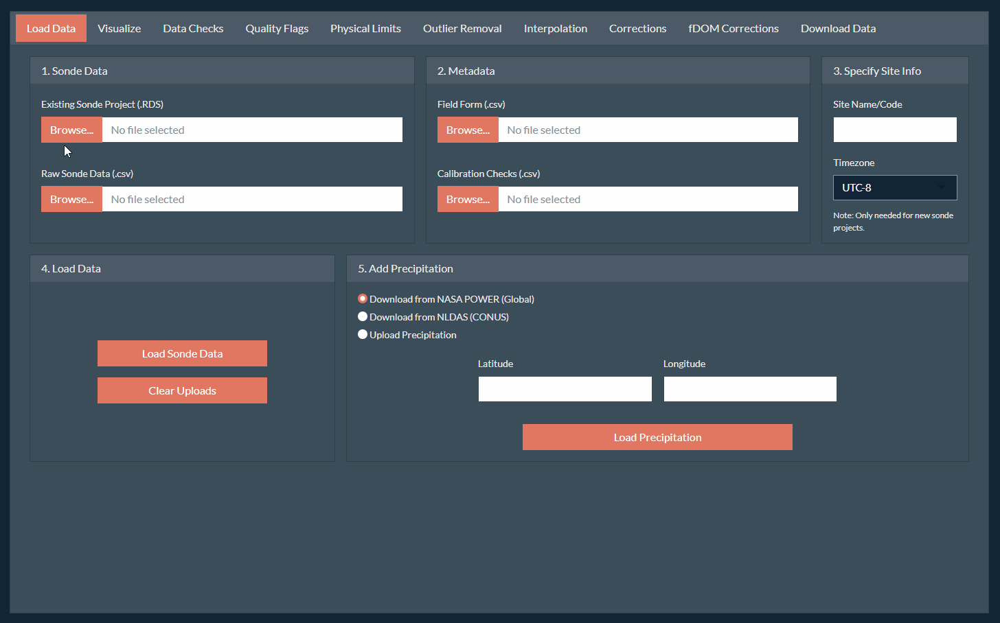
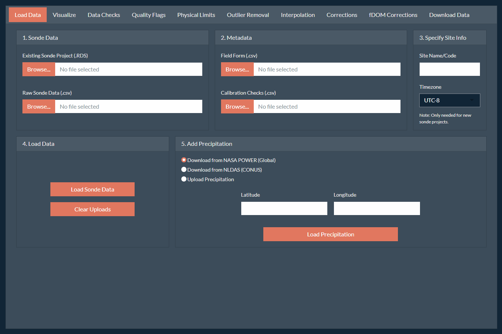

```{css style settings, echo = FALSE}
blockquote {
    padding: 10px 20px;
    margin: 0 0 20px;
    font-size: 14px;
    border-left: 5px solid;
}
```

# Overview

Correction of continuous water quality records can be a complicated task as the data can span a large time range and can include several parameters which may require different types of corrections and checks. The following workflow was developed as a suggested process to correct a complete water quality record of stream water quality using the `SondePolishR` app.

TODO: include a workflow diagram here.

# Step 1: Open the App

1.  Install the `SondePolishR` package.

    ```{r eval=FALSE, include=TRUE}
    pak::pak("wildfire-water-security/WWS-Node1-SondePolishR-sonde-qaqc")
    ```

2.  Run the follow code to open the app:

    ```{r eval=FALSE, include=TRUE}
    library(SondePolishR)
    run_app()
    ```

# Step 2: Load Data

1.  **Specify data file locations:** Upon loading the app, you should be on the **Load Data** tab. On the first card (1. Sonde Data), use the **Browse** button to navigate to the data file(s) you want to load. This step does not load the data. It simply tells the app were the data you want to load is located.

    > Specifically, this step will copy your selected files to temporary folder which is where the app loads the files from, so no changes will be made to your original data files.

    -   If you have an existing project saved from previously using the app you can load this using the **Existing Sonde Project** option.

    -   Otherwise, load one or more `.csv` files using the **Raw Sonde Data** option.

    -   If you would like to add new raw files to an exisiting project, you may select both a project and a raw file. They will be merged together upon load.

2.  **Specify metadata file locations:** Similar to locating your data files, you can select metadata files to add to your project. These include:

    -   A **field form** (`help(example_fieldform)`) which describes information from field visits and is used to calculate out of water periods.

    -   A **calibration check file** (`help(example_calcheck)`) which contains data from field calibration checks used to make drift corrections.

    > Both files are optional but some app options will not work without them (e.g., viewing or removing out of water periods, better automated guesses for drift corrections).

3.  **Specify site code and site timezone.**

    -   Specify a site code or name which will be used for default file names and included in any data exports.

    -   Select the appropriate timezone for your dataset. It is assumed that all files (raw data and metadata) use this same timezone.

    > If you're loading a project and have previously specified this info you do not need to re-add it, this info gets saved within the sonde project and will be loaded with the rest of the data.

4.  **Load the data:** Use the **Load Data** section to load your selected data by clicking the **Load Sonde Data** button.

    -   The loaded files will remain unless a new file is uploaded. If you're switching to a new site or data project, it's recommended to clear your file uploads first using the **Clear Uploads** button which will clear all the file locations.

5.  **Load Precipitation Data:** Precipitation data can be extremely helpful in making decisions about data corrections as it can help determine if observed spikes could have been caused by increased flows. There are currently three options for adding precipitation data to the project:

    -   **NASA Merra-2 (POWER):** This dataset is available across a global scale at a resolution of 0.5 x 0.625 degrees available from 1981 to near real time at an hourly scale. Due to it's global coverage, it may not capture small or localized events as well.

    -   **NASA NLDAS:** This dataset is available across CONUS at a resolution of 0.125 × 0.125 degrees available from 1981 to near real time at an hourly scale. This data requires a token to access the data. See [NASA Earthdata](https://urs.earthdata.nasa.gov/documentation/for_users/user_token) for directions on creating a token. *Note that this token should be kept secret.*

        > The API for this product can also be unreliable, it make take a bit to load and you may need to try more than once.

    -   **User uploaded precipitation:** You can also upload a custom precipitation file. See `help(example_precip)` for details on the structure of this file.

    If you choose to download precipitation data, input your site latitude and longitude, enter your earth data token (if applicable) and click **Load Precipitation**. This will download hourly precipitation data at the specified point over the date range of your data.

  ```{r, echo=FALSE, out.width="100%"}
  
  ```

# Step 3: Save Initial Project

While every effort has been made to prevent the app from crashing. It's a new app still under development and bugs can occur. **It's recommend to save your project frequently** to prevent loss of work. To save your project:

1.  Navigate to the **Download Data** tab on the far right.

2.  Locate the **Save Sonde Project** section in the bottom right. Similar to uploading your data, use the **Choose Location** button to select where you want to save your project to and what name to use for your project. You can use the selector in the top to change your root directory. Click **Save** to confirm the save location.

    > Important: Your project is not saved at this point! You must also click the **Export Project** button to save the project to your specified file.

3.  Click **Export Project** to save your project to the specified file.

  ```{r, echo=FALSE, out.width="100%"}
  
  ```
