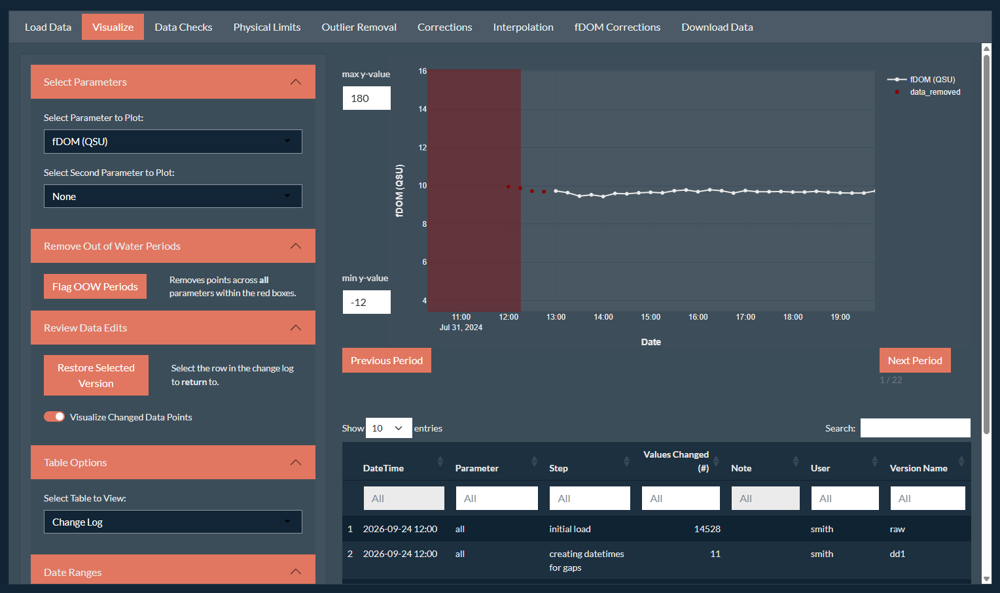
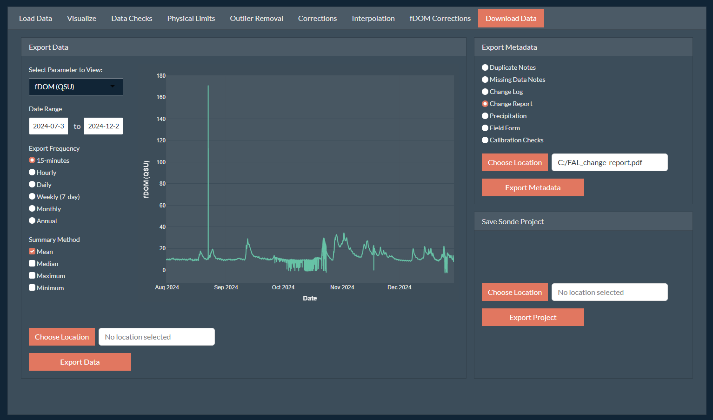
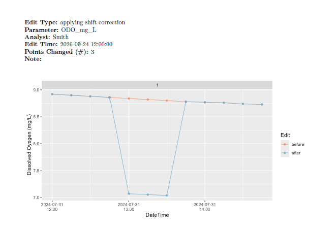

```{css style settings, echo = FALSE}
blockquote {
    padding: 10px 20px;
    margin: 0 0 20px;
    font-size: 14px;
    border-left: 5px solid;
}
```

## Why Review Data Corrections?

Data corrections, particularly with messy data, have a level of subjectivity where different analysts may make a different correction decision. The semi-automated nature of the app and a clear workflow is meant to help with that subjectivity, however, differences may remain. While these differences are often not likely to be statistically significant and influence future data analysis, it is still good practice to perform a secondary check on any data corrections. For instance, a review procedure with a second analyst is [required](https://water.usgs.gov/admin/memo/QW/qw2017.07.pdf) for publishing USGS time-series data.

All changes made to the raw dataset via the SondePolishR app are tracked with the integrated version control system, which allows you to view the step-by-step changes made to the data, along with any notes associated with the change. Beyond being able to review the changes, tracking these changes helps ensure that data cleaned with SondePolishR adhers to **reusable** principle of the [FAIR Data Principles](https://doi.org/10.1038/sdata.2016.18).

## How to Review Data Corrections

SondePolishR has two options to review data corrections within a sonde project in a user-friendly way.

### Interactively

If you would like to more thoroughly explore the changes made using zoom tools, along with supporting information (i.e., secondary y-axis), use the **interactive** method. This method is built into the SondePolishR app, and thus works best when internally since both the analyst and reviewer need to have access to both the app and the sonde project.



1.  Open the app and load the project you would like to review. For more details on running the app and loading a project see the [App User Guide](app-manual.html).

2.  Navigate to the **Visualize** tab. Ensure that the Table Options panel on the left is set to view the Change Log.

3.  Toggle the option to "Visualize Changed Data Points"

4.  Click on a row within the Change Log to view the changes made to get to that data version. **Note that most changes only apply to a single parameter, so if you are not viewing that parameter you will not see any changes.** All of the normal tools for visualizing the dataset (e.g., viewing by period, adjusting the y-axis, adding a secondary y-axis) are available to the reviewer to review the change.

    > **Hint:** You can filter the changes by parameter to step through each change made to the parameter currently being plotted by clicking the white "All" between the Header and the first row.

To review an entire record, go through each parameter, clicking and viewing each change applied to that parameter in order of the change log.

### Non-Interactively

An alternative method which is more broadly accessible and does not require the reviewer to use the SondePolishR app is to generate a change report. This is a `pdf` file which shows and describes each change made to the data. This method was designed to be included in a data package along with processed data to describe the changes that were made to any data users. The report can be generated in the app using the `generate_report` function.



1.  Open the app and load the project you would like to generate a report for. For more details on running the app and loading a project see the [App User Guide](app-manual.html).

2.  Navigate to the **Download Data** tab.

3.  Under the **Export Metadata** panel, select the "Change Report" option.

4.  Use the **Choose Location** button to select where you want to save your report to and what name to use for your report. You can use the selector in the top to change your root directory. Click **Save** to confirm the save location.

5.  Click the **Export Metadata** function. It will generate the report and write it to the specified file as a `pdf` file.

    > **Note:** Depending on the length of your dataset and the number of changes, generating the report can take several minutes. The function iteratively, for each change, applies the data change, subsets the data to plot, creates and saves a plot, and then knits all the information together into a large `pdf`.

#### Report Structure 

The report includes:

-   **A cover page**:

    -   the site name

    -   the date the report was generated

    -   the name of the analyst that generated the report

    -   the version of the app the report was generated with

-   **A page per entry in the change log**:

    -   the type of edit

    -   the parameter(s) that were edited

    -   the analyst that made the change

    -   the date and time the edit was made

    -   the number of points that were changed

    -   any notes about the change; includes both the automatically generated notes and any analyst notes

    -   a plot showing the data before and after the change, zoomed in to the region(s) that were edited

{width="539"}
